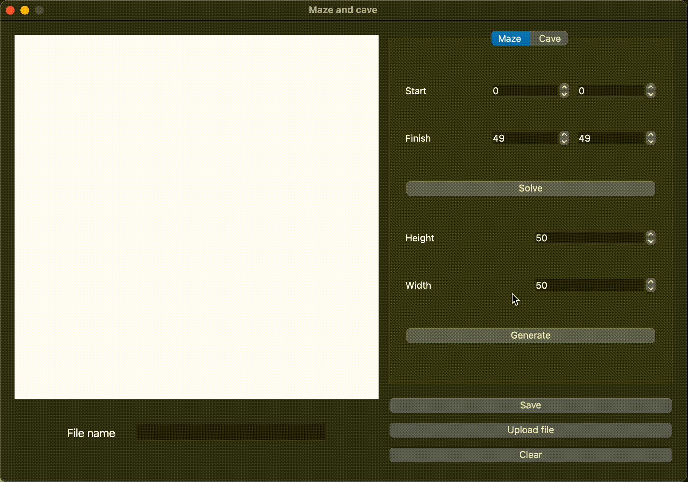
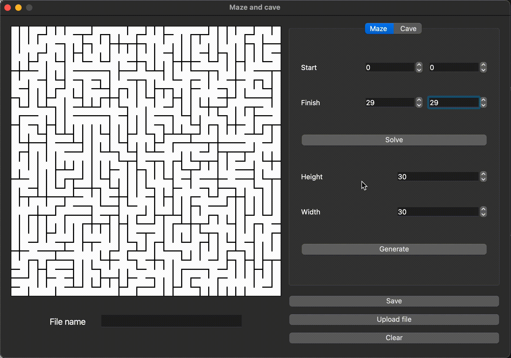
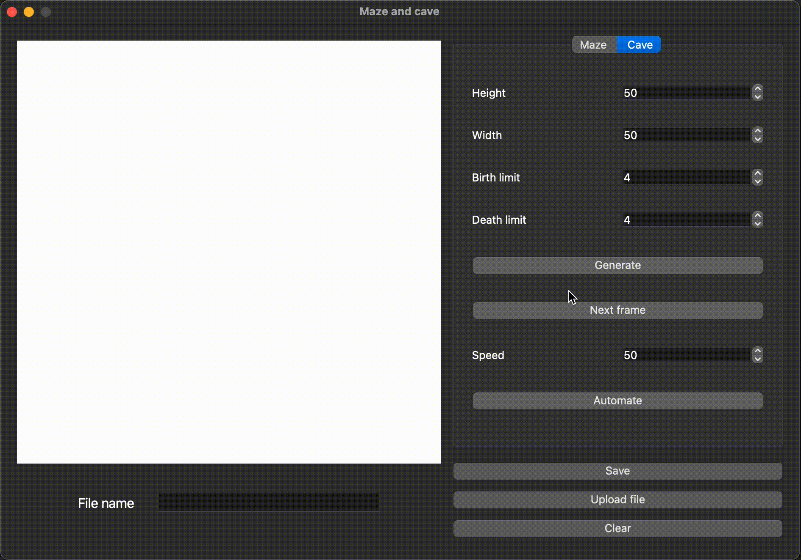
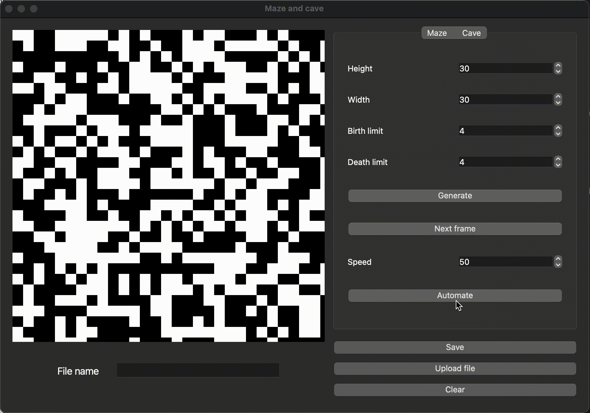

# Maze and caves
The "Maze and caves" is a modern app written in C++. The application generates and views 2D models of mazes and caves, loaded from files that can be viewable on the screen with the ability to solve maze and cellular automaton caves generation.

## Features
- Load model of maze from a specific file.
- Generate the maze according to Eller's algorithm.
- Generated maze not have isolations and loops.
- User can set the dimensionality of the maze: the number of rows and columns.
- Generated maze can be saved in the specific file format.

  

- Showing the solution to any maze currently shown on the screen.
- User can sets the starting and ending points.

  

- Load model of cave from a specific file.
- Generate the random cave.
- User can set the dimensionality of the cave: the number of rows and columns.
- Generated cave can be saved in the specific file format.

  

- Cave can be generated by using a cellular automaton.
- User can sets the limits for "birth" and "death" of a cell.
- Step-by-step rendering the results of the algorithm in manual and automatic mode.

  

## License
Copyright (c). All rights reserved.
